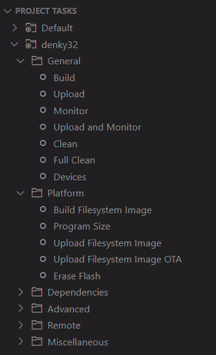
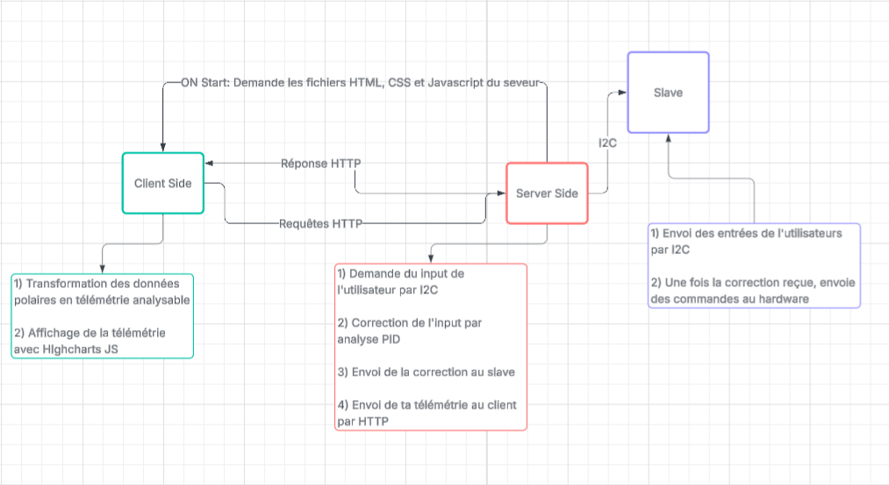
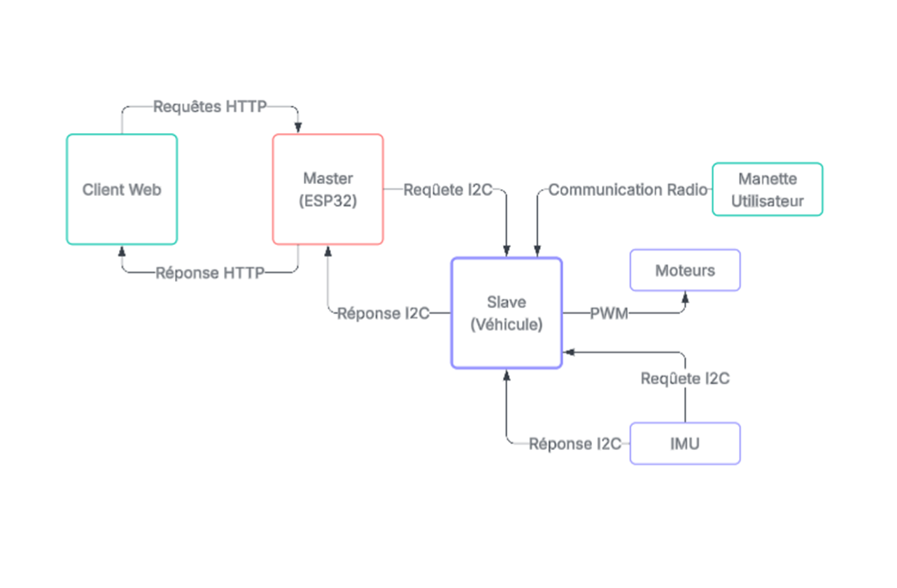
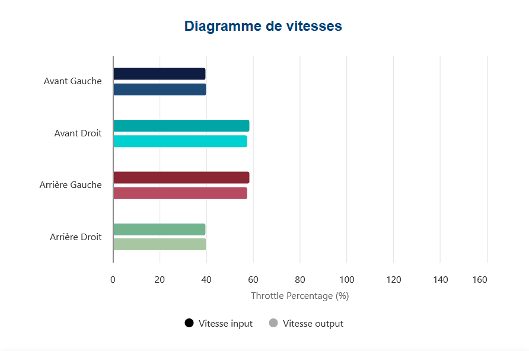

# Projet d'intégration SIM H25

#### Note: Voir le répo [slave](https://github.com/zon-n/prog4-slave) pour les informations sur l'appareil slave du projet

## Table des matières

1. [Présentation](#présentation)  
2. [Objectifs du projet](#objectifs-du-projet)  
3. [Matériel utilisé](#matériel-utilisé)  
4. [Architecture technique](#architecture-technique)  
5. [Schémas et diagrammes de classes](#schémas-et-diagrammes-de-classes)
6. [Installation et assemblage](#installation-et-assemblage)
7. [Description de l’algorithme de contrôle de traction](#description-de-lalgorithme-de-contrôle-de-traction)  
8. [Tests et résultats](#tests-et-résultats)  
9. [Améliorations supplémentaires](#améliorations-supplémentaires)
10. [Ressources supplémentaires](#ressources-supplémentaires)  

---

## Présentation

### Algorithme de contrôle de traction pour optimiser la performance et le pilotage d'un véhicule imprimé en 3D

Ce projet vise à concevoir une voiture téléguidée optimisée à l'aide d'un algorithme de contrôle de traction. Le véhicule, inspiré du design de la Formule 1, utilise un châssis imprimé en 3D et est équipé d'un accéléromètre, d'un gyroscope et d'un magnétomètre. L'architecture du projet est modulable et open-source, permettant une évolution facile et une personnalisation par la communauté. Ce projet a pour but d'améliorer l'adhérence en virage et d'optimiser la performance globale du véhicule à travers un contrôle précis du moteur en fonction des conditions de conduite.

---

## Objectifs du projet

Les objectifs principaux du projet sont les suivants :

- Concevoir un châssis rigide et léger via un logiciel de CAO, adapté à un modèle de véhicule téléguidé.
- Imprimer en 3D et assembler un véhicule fonctionnel, prêt à être testé sur différentes surfaces et en virage.
- Intégrer des capteurs de mouvement (accéléromètre, gyroscope, magnétomètre) pour analyser la dynamique du véhicule en temps réel.
- Développer un algorithme de contrôle PID pour améliorer l'adhérence en virage et optimiser les performances du véhicule sur différents types de surface (asphalte, gravier, etc.).

---

## Matériel utilisé

La liste complète du matériel utilisé est disponible dans le fichier `BOM.xlsx`. Voici un aperçu du matériel principal :

- **Châssis** : Imprimé en 3D
- **Capteurs** : MPU9250 (accéléromètre, gyroscope, magnétomètre)
- **Moteur** : Moteur à courant continu contrôlé par PWM
- **Microcontrôleur** : ESP32 (pour le contrôle des moteurs et la communication Wi-Fi)
- **Batterie** : Li-Po 7.4V pour alimenter les moteurs et la carte électronique
- **Module Wi-Fi** : ESP32 intégré pour la communication sans fil
- **Structure et composants supplémentaires** : Roues, suspensions, pièces imprimées en 3D, etc.

---

## Installation et assemblage

### Modélisation des composantes mécaniques

Les fichiers `.step` contenant les modèles 3D des composantes mécaniques sont situés dans le dossier `/CAD`. Ils peuvent être imprimés en 3D avec une imprimante avec une surface d'impression de au moins 250 x 250 x 250 mm.

Les modèles peuvent êtres importés dans un logiciel de Slicer comme [PrusaSlicer](https://www.prusa3d.com/page/prusaslicer_424/) ou [OrcaSlicer](https://github.com/SoftFever/OrcaSlicer).

Il est recommandé d'imprimer les modèles avec les paramètres suivants:

```* Tête 0.4mm ou 0.6mm
* 40% Remplissage
* Remplissage de type Gyroid ou Cubic
* Au moins 3 murs de remplissage
* Matériaux recommandés: ABS, ASA
```

### Installation des logiciels et librairies

Le projet est développé à l'aide du framework **PlatformIO** pour le développement embarqué et des librairies Arduino.

1. **Installation de PlatformIO** : [https://platformio.org/install](https://platformio.org/install)

2. **Installation de l'Arduino IDE** : [https://www.arduino.cc/en/software](https://www.arduino.cc/en/software)

3. **Librairies nécessaires** :

* `MPU9250` : pour lire les données de l'accéléromètre, du gyroscope et du magnétomètre
* `PID` : pour appliquer l'algorithme de régulation PID sur le moteur
* `ESPAsyncWebServer` : pour créer une interface Web asynchrone sur l'ESP32
* `AsyncTCP` : utilisé avec `ESPAsyncWebServer` pour la communication réseau
* `Arduino_JSON` : pour manipuler les données JSON dans les échanges Web
* `WiFi` : pour connecter l'ESP32 au réseau sans fil
* `HighCharts` : Libraire Javascript pour la génération de diagrammes. 
   #### Voir les [ressources supplémentaires](#ressources-supplémentaires) pour plus d'informations


### Accès à la page Web de télémétrie
Avant de téléverser le programme `c++` sur le ESP32, il faudra charger les données `html`, `css` et `javascript` sur le système de mémoire interne `LittleFS` du ESP32. Le API de PlatformIO permet d'écrire les fichiers du front end avec la fonction `Upload Filesystem Image` dans l'onglet de l'extension PlatformIO. 



Il faudra aussi modifier les informations du réseau local désiré dans le fichier `/src/main.cpp`. Les variables `*ssid` et `*password` seront à modifier

Exemple:

```c
const char *ssid = "SSID";
const char *password = "PASSWORD";
```

Changé à 

```c
const char *ssid = "MY_SSID";
const char *password = "MY_PASSWORD";
```

Lorsque le programme sera initialisé, la méthode `setup()` initialisera une instance d'un serveur asynchrome (AsyncWEbServer). L'addresse local du serveur sera imprimée sur la console. Il faudra naviguer à cette addresse sur le réseau local pour y avoir accès. 

---

## Architecture technique



### Modules principaux

1. **Acquisition des données**  
   - **Capteur MPU9250** : Lecture des valeurs d'accélération, de vitesse angulaire et de champ magnétique pour déterminer la position, la vitesse et l'orientation du véhicule. La combinaison des senseurs pour améliorer la qualité des données est éffectuée par la librairie [MPU9250](https://github.com/hideakitai/MPU9250)

2. **Traitement des données**  
   - **Filtrage et analyse** : Comparaison des données captées par les capteurs avec les objectifs de conduite de l'utilisateur (vitesse, angle de virage, etc.).
   - **Correction de l'entrée de l'utilisateur** : Utilisation des données pour ajuster les actions du système de contrôle PID.

3. **Contrôle PID du moteur**  
   - Réglage dynamique de la puissance moteur en fonction des entrées du système PID.

4. **Communication**  
   - **Transmission Wi-Fi** : Envoi des données de télémétrie à une page Web en temps réel pour visualiser les performances du véhicule.
   - **Envoi de la correction par I2C** : Communication bidirectionnelle pour envoyer des corrections à l'algorithme de contrôle du moteur en fonction des ajustements faits par l'utilisateur ou le système.
   - **Requête http**: Envoi des requêtes pour ajuster les paramètres de l'algorithme PID en temps réel.

5. **Interface utilisateur (UI)**  
   - **Graphique de télémétrie**: Affichage graphique de la puissance des moteurs en temps réel
   - **Réglage PID à distance** : Interface Web permettant de modifier les paramètres du PID en temps réel.
   - **Courbe d'analyse** : Affichage graphique des entrées et sorties du système PID pour analyser la performance du véhicule.

---

## Schémas et diagrammes


---

### Protocoles de communication

Le projet utilise plusieurs protocoles pour gérer les différents composants :

1. **PWM** : Utilisé pour contrôler la vitesse des moteurs en ajustant la largeur des impulsions électriques.
2. **I2C** : Utilisé pour la communication avec le capteur MPU9250. Établit la connection d'envoi binaire avec un appareil [slave](https://github.com/zon-n/prog4-slave)
3. **Wi-Fi** : Pour la communication sans fil entre le véhicule et la page Web pour afficher la télémétrie et ajuster les paramètres du système.
4. **HTTP** : Pour la requête de données et la calibration en temps réel à travers l'interface web. 
5. **Radio 2.4Ghz** : Communication des commandes d'utilisateurs à longue portée.

---

## Description de l’algorithme de contrôle de traction

L'algorithme de contrôle de traction utilise un **PID** (Proportionnel-Intégral-Dérivé) pour réguler la vitesse des moteurs du véhicule et optimiser son adhérence pendant les virages. Voici un aperçu de son fonctionnement :

1. **Proportionnel** : La réponse est directement proportionnelle à l'écart entre la vitesse mesurée et la vitesse souhaitée.
2. **Intégral** : Permet de compenser les erreurs accumulées sur le temps pour corriger les déviations lentes.
3. **Dérivé** : Réagit aux changements rapides de l'écart, ajustant la puissance du moteur pour éviter les oscillations.

L'algorithme ajuste dynamiquement la puissance des moteurs en fonction de l'adhérence de la surface, de la vitesse et de l'angle de virage.

---

## Tests et résultats

### Tests effectués

- **Tests de vitesse** : Validation de la capacité du véhicule à atteindre et maintenir une vitesse constante.
- **Tests en virage** : Vérification de la performance du contrôle PID en fonction de différents angles de virage et types de surface.
- **Tests de contrôle par interface Web** : Vérification de la performance de la platforme Web hébergé sur le ESP32. L'accès local permet une connection facile à la page web

### Résultats obtenus

- Le télémétrie montre une déviation entre l'entrée d'utilisateur et la correction
- Le véhicule roule droit lors des test élémentaires
- La télémétrie en temps réel a permis de visualiser l'impact des réglages PID sur la performance du véhicule

#### Exemple de résultat

Avant l'activation de la contrôle de traction, l'appareil Master demande le signal de contrôle reçu par l'appareil Slave par **I2C**. Il renvoie ensuite les données sur la page web et ne corrige pas la donnée. L'entrée de l'utilisateur est donc la même que la sortie sur les moteurs.




Après l'activation de la contrôle de traction, on voit une déviation entre les entrés d'utilisateurs et la sortie sur les roues. Le signal de contrôle demandé par l'appareil Master du Slave par **I2C** est traité par l'algoritheme de **PID** pour être ensuite renvoyé par **I2C** au slave pour actionner les moteurs. Les données sont ensuites envoyées sur la page web pour analyse.

### Améliorations supplémentaires
- Calibration des consantes PID: Jusqu'à maintenant la calibration des constantes proportionnelles, intégrales et dérivées ont été faites à la main. Dans certains cas, la performance était inférieure après le contrôle PID que sans. Il serait donc envisageable de développer un algorithme de calibration automatique pour trouver les constantes PID optimales pour des conditions variées. 
- Incorporation de plus d'information télémétriques pour analyse sur le front-end Javascript du client
- Optimisation du système mécanique pour réduire les bruits des signaux des capteurs

---

## Ressources supplémentaires

- **Documentation sur l'ESP32** : [https://docs.espressif.com/](https://docs.espressif.com/)
- **Documentation sur PlatformIO**: [https://platformio.org/](https://platformio.org/)
- **Docoumentation sur Arduino**: [https://www.arduino.cc/en/software/](https://www.arduino.cc/en/software/)

- **Hyperliens vers les répositoires Github des libraires utilisées**
   * [hideakitai/MPU9250@](https://github.com/hideakitai/MPU9250)
   * [br3ttb/PID@](https://github.com/br3ttb/Arduino-PID-Library)
   * [esp32async/AsyncTCP](https://github.com/ESP32Async/AsyncTCP)
   * [esp32async/ESPAsyncWebServer](https://github.com/ESP32Async/ESPAsyncWebServer)
   * [arduino/ArduinoJSON](https://github.com/arduino-libraries/Arduino_JSON)
   * [HighChartsJS](https://www.highcharts.com/)